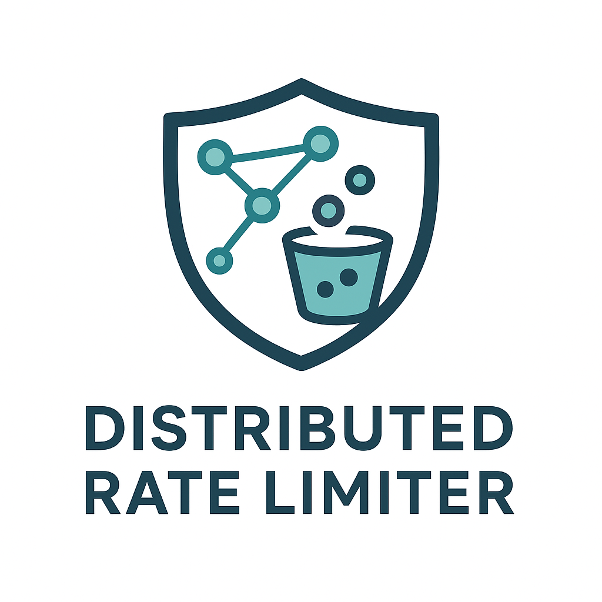

<div align="center">



# 🚀 Distributed Rate Limiter

**High-performance, Redis-backed rate limiter service with multiple algorithms and REST API**

[](https://openjdk.java.net/projects/jdk/21/)
[](https://spring.io/projects/spring-boot)
[](https://redis.io/)
[](LICENSE.md)
[](https://github.com/uppnrise/distributed-rate-limiter/actions)

[📦 Download](#-installation) • [📖 Documentation](#-documentation) • [🚀 Quick Start](#-quick-start) • [💡 Examples](#-examples)

</div>

---

## 🎯 Overview

A production-ready distributed rate limiter supporting **four algorithms** (Token Bucket, Sliding Window, Fixed Window, and Leaky Bucket) with Redis backing for high-performance API protection. Perfect for microservices, SaaS platforms, and any application requiring sophisticated rate limiting with algorithm flexibility and traffic shaping capabilities.

### ✨ Key Features

- 🏃‍♂️ **High Performance**: 50,000+ requests/second with <2ms P95 latency
- 🎯 **Four Algorithms**: Token Bucket, Sliding Window, Fixed Window, and Leaky Bucket for traffic shaping
- 🌐 **Distributed**: Redis-backed for multi-instance deployments
- ⚡ **Production Ready**: Comprehensive monitoring, health checks, and observability
- 🛡️ **Thread Safe**: Concurrent request handling with atomic operations
- 📊 **Rich Metrics**: Built-in Prometheus metrics and performance monitoring
- 🧪 **Thoroughly Tested**: 265+ tests including integration and load testing
- 🐳 **Container Ready**: Docker support with multi-stage builds
- 🔧 **Flexible Configuration**: Per-key limits, burst handling, and dynamic rules

### 📊 Performance Characteristics

| Metric | Value |
|--------|--------|
| **Throughput** | 50,000+ RPS |
| **Latency P95** | <2ms |
| **Memory Usage** | ~200MB baseline + buckets |
| **Redis Ops** | 2-3 per rate limit check |
| **CPU Usage** | <5% at 10K RPS |

---

## 📚 Documentation

### API Documentation
- **[Interactive API Documentation](http://localhost:8080/swagger-ui/index.html)** - Swagger UI (when running)
- **[OpenAPI Specification](http://localhost:8080/v3/api-docs)** - Machine-readable API spec (when running)
- **[Complete API Reference](docs/API.md)** - Comprehensive API documentation with examples

> **Note**: The API provides 18 endpoints covering rate limiting, configuration management, administrative operations, performance monitoring, benchmarking, and system metrics.

### Usage Examples
- **[Java/Spring Boot Integration](docs/examples/java-client.md)** - Complete integration example
- **[Python Client](docs/examples/python-client.md)** - Flask/FastAPI integration
- **[Node.js Client](docs/examples/nodejs-client.md)** - Express.js middleware
- **[Go Client](docs/examples/go-client.md)** - Native HTTP client with middleware
- **[cURL Examples](docs/examples/curl-examples.md)** - Command-line testing

### Architecture & Design
- **[Architecture Decision Records](docs/adr/README.md)** - Design decisions and rationale
- **[Rate Limiting Algorithms](docs/adr/001-token-bucket-algorithm.md)** - Algorithm comparison and selection
- **[Fixed Window Algorithm](docs/adr/003-fixed-window-algorithm.md)** - Fixed Window implementation details
- **[Redis Integration](docs/adr/002-redis-distributed-state.md)** - Distributed state design

### Deployment & Operations
- **[Deployment Guide](docs/deployment/README.md)** - Docker, Kubernetes, and production deployment
- **[Configuration Guide](CONFIGURATION.md)** - Detailed configuration options
- **[Docker Usage](DOCKER.md)** - Container deployment instructions
- **[Performance Guide](PERFORMANCE.md)** - Optimization and tuning
- **[Load Testing Guide](LOAD-TESTING.md)** - Benchmarking and performance testing

---

## 📦 Installation

### Option 1: Download JAR (Recommended)

```bash
# Download the latest release
wget https://github.com/uppnrise/distributed-rate-limiter/releases/download/v1.0.0/distributed-rate-limiter-1.0.0.jar

# Verify checksum (optional)
wget https://github.com/uppnrise/distributed-rate-limiter/releases/download/v1.0.0/distributed-rate-limiter-1.0.0.jar.sha256
sha256sum -c distributed-rate-limiter-1.0.0.jar.sha256
```

### Option 2: Docker

```bash
# Run with Docker Compose (includes Redis)
wget https://github.com/uppnrise/distributed-rate-limiter/releases/download/v1.0.0/docker-compose.yml
docker-compose up -d

# Or run the image directly
docker run -p 8080:8080 ghcr.io/uppnrise/distributed-rate-limiter:1.0.0
```

### Option 3: Build from Source

```bash
git clone https://github.com/uppnrise/distributed-rate-limiter.git
cd distributed-rate-limiter
./mvnw clean install
java -jar target/distributed-rate-limiter-1.0.0.jar
```

---

## 🚀 Quick Start

### Prerequisites

- **Java 21+** (OpenJDK or Oracle JDK)
- **Redis server** (local or remote)
- **2GB RAM minimum** for production usage

### 1. Start the Application

```bash
# Simple startup (embedded configuration)
java -jar distributed-rate-limiter-1.0.0.jar

# With external Redis
java -jar distributed-rate-limiter-1.0.0.jar \
  --spring.data.redis.host=your-redis-server \
  --spring.data.redis.port=6379
```

### 2. Verify Health

```bash
curl http://localhost:8080/actuator/health
```

**Expected Response:**
```json
{
  "status": "UP",
  "components": {
    "redis": {"status": "UP"},
    "rateLimiter": {"status": "UP"}
  }
}
```

### 3. Test Rate Limiting

```bash
# Check rate limit for a key
curl -X POST http://localhost:8080/api/ratelimit/check \
  -H "Content-Type: application/json" \
  -d '{"key": "user:123", "tokens": 1}'
```

**Response:**
```json
{
  "allowed": true,
  "remainingTokens": 9,
  "resetTimeSeconds": 1694532000,
  "retryAfterSeconds": null
}
```

### 🌐 Access Points

The application will be available at:
- **API**: http://localhost:8080
- **Swagger UI**: http://localhost:8080/swagger-ui/index.html
- **Health Check**: http://localhost:8080/actuator/health

---

## 💡 Examples

### Basic Rate Limiting

```bash
# Check if request is allowed
curl -X POST http://localhost:8080/api/ratelimit/check \
  -H "Content-Type: application/json" \
  -d '{
    "key": "api:user123", 
    "tokens": 1
  }'
```

### Batch Operations

```bash
# Check multiple keys at once
curl -X POST http://localhost:8080/api/ratelimit/batch \
  -H "Content-Type: application/json" \
  -d '{
    "requests": [
      {"key": "user:123", "tokens": 1},
      {"key": "user:456", "tokens": 2}
    ]
  }'
```

### Configuration Management

```bash
# Set custom rate limit for a key
curl -X POST http://localhost:8080/admin/config \
  -H "Content-Type: application/json" \
  -d '{
    "key": "premium:user123",
    "capacity": 1000,
    "refillRate": 100,
    "refillPeriodSeconds": 60
  }'

# Get current configuration
curl http://localhost:8080/admin/config/premium:user123
```

### E-commerce Flash Sale Protection

```bash
# High-capacity bucket for flash sale endpoint
curl -X POST http://localhost:8080/admin/config \
  -H "Content-Type: application/json" \
  -d '{
    "key": "flash-sale:product123",
    "capacity": 10000,
    "refillRate": 500,
    "refillPeriodSeconds": 1
  }'
```

### API Tier-based Limiting

```bash
# Free tier: 100 requests/hour
curl -X POST http://localhost:8080/admin/config \
  -H "Content-Type: application/json" \
  -d '{
    "key": "api:free:*",
    "capacity": 100,
    "refillRate": 100,
    "refillPeriodSeconds": 3600
  }'

# Premium tier: 10,000 requests/hour
curl -X POST http://localhost:8080/admin/config \
  -H "Content-Type: application/json" \
  -d '{
    "key": "api:premium:*",
    "capacity": 10000,
    "refillRate": 10000,
    "refillPeriodSeconds": 3600
  }'
```

### Traffic Shaping with Leaky Bucket (**NEW**)

```bash
# Configure leaky bucket for downstream service protection
curl -X POST http://localhost:8080/api/ratelimit/config/patterns/gateway:* \
  -H "Content-Type: application/json" \
  -d '{
    "capacity": 50,
    "refillRate": 10,
    "algorithm": "LEAKY_BUCKET"
  }'

# Process exactly 10 requests per second, queue up to 50 requests
curl -X POST http://localhost:8080/api/ratelimit/check \
  -H "Content-Type: application/json" \
  -d '{
    "key": "gateway:payment_service",
    "tokens": 1
  }'

# Database connection pool protection
curl -X POST http://localhost:8080/api/ratelimit/config/keys/db:connection_pool \
  -H "Content-Type: application/json" \
  -d '{
    "capacity": 20,
    "refillRate": 5,
    "algorithm": "LEAKY_BUCKET"
  }'
```

### Spring Boot Integration

```java
// Integration example with Spring Boot
@RestController
public class ProtectedController {
    
    @Autowired
    private RateLimitService rateLimitService;
    
    @GetMapping("/api/data")
    public ResponseEntity<?> getData(HttpServletRequest request) {
        String userId = extractUserId(request);
        
        RateLimitResponse response = rateLimitService.checkLimit(
            "api:user:" + userId, 1
        );
        
        if (!response.isAllowed()) {
            return ResponseEntity.status(429)
                .header("X-RateLimit-Remaining", "0")
                .header("X-RateLimit-Reset", response.getResetTimeSeconds().toString())
                .body("Rate limit exceeded");
        }
        
        return ResponseEntity.ok(fetchData(userId));
    }
}
```

---

## 🏗️ Architecture

### System Architecture

```
┌─────────────────┐    ┌─────────────────┐    ┌─────────────────┐
│   Client App    │───▶│  Rate Limiter   │───▶│     Redis       │
│                 │    │   (Port 8080)   │    │   (Distributed  │
│                 │    │                 │    │     State)      │
└─────────────────┘    └─────────────────┘    └─────────────────┘
                                │
                                ▼
                       ┌─────────────────┐
                       │   Monitoring    │
                       │   & Metrics     │
                       │  (Prometheus)   │
                       └─────────────────┘
```

### Rate Limiting Algorithms

The rate limiter supports four different algorithms optimized for different use cases:

#### 🪣 Token Bucket (Default)
- **Best for**: APIs requiring burst handling with smooth long-term rates
- **Characteristics**: Allows bursts up to capacity, gradual token refill
- **Use cases**: General API rate limiting, user-facing applications

#### 🌊 Sliding Window
- **Best for**: Consistent rate enforcement with precise timing
- **Characteristics**: Tracks requests within a sliding time window
- **Use cases**: Critical APIs requiring strict rate adherence

#### 🕐 Fixed Window  
- **Best for**: Memory-efficient rate limiting with predictable resets
- **Characteristics**: Counter resets at fixed intervals, low memory usage
- **Use cases**: High-scale scenarios, simple rate limiting needs

#### 🚰 Leaky Bucket (**NEW**)
- **Best for**: Traffic shaping and consistent output rates
- **Characteristics**: Queue-based processing at constant rate, no bursts allowed
- **Use cases**: Downstream service protection, SLA compliance, network-like behavior

**Algorithm Selection**: Configure per key pattern or use runtime configuration to select the optimal algorithm for each use case.

---

## 🔧 Configuration

### Basic Configuration

The rate limiter supports hierarchical configuration:

1. **Per-key configuration** (highest priority)
2. **Pattern-based configuration** (e.g., `user:*`, `api:v1:*`)
3. **Default configuration** (fallback)

### Application Properties

```properties
# Redis Configuration
spring.data.redis.host=localhost
spring.data.redis.port=6379
spring.data.redis.password=
spring.data.redis.database=0

# Rate Limiter Defaults
ratelimiter.default.capacity=10
ratelimiter.default.refill-rate=10
ratelimiter.default.refill-period-seconds=60

# Performance Tuning
ratelimiter.redis.connection-pool-size=20
ratelimiter.performance.metrics-enabled=true
ratelimiter.performance.detailed-logging=false

# Server Configuration
server.port=8080
management.endpoints.web.exposure.include=health,metrics,info
```

### Environment Variables

```bash
# Production deployment
export SPRING_DATA_REDIS_HOST=redis.production.com
export SPRING_DATA_REDIS_PASSWORD=your-redis-password
export RATELIMITER_DEFAULT_CAPACITY=100
export RATELIMITER_DEFAULT_REFILL_RATE=50
export SERVER_PORT=8080
```

### Dynamic Configuration

Update configuration at runtime via REST API:

```bash
# Update default limits
curl -X POST http://localhost:8080/api/ratelimit/config/default \
  -H "Content-Type: application/json" \
  -d '{"capacity":20,"refillRate":5}'

# Set limits for specific keys
curl -X POST http://localhost:8080/api/ratelimit/config/keys/vip_user \
  -H "Content-Type: application/json" \
  -d '{"capacity":200,"refillRate":50}'
```

---

## 🛡️ API Endpoints

The application provides a comprehensive REST API with the following endpoints:

### Rate Limiting Operations
- `POST /api/ratelimit/check` - Check if request is allowed for a key
- `GET /api/ratelimit/config` - Get current rate limiter configuration
- `POST /api/ratelimit/config/default` - Update default configuration
- `POST /api/ratelimit/config/keys/{key}` - Set configuration for specific key
- `POST /api/ratelimit/config/patterns/{pattern}` - Set configuration for key pattern
- `DELETE /api/ratelimit/config/keys/{key}` - Remove key-specific configuration
- `DELETE /api/ratelimit/config/patterns/{pattern}` - Remove pattern configuration
- `POST /api/ratelimit/config/reload` - Reload configuration and clear caches
- `GET /api/ratelimit/config/stats` - Get configuration statistics

### Administrative Operations
- `GET /admin/keys` - List all active rate limiting keys with statistics
- `GET /admin/limits/{key}` - Get current limits for a specific key
- `PUT /admin/limits/{key}` - Update limits for a specific key
- `DELETE /admin/limits/{key}` - Remove limits for a specific key

### Performance Monitoring
- `POST /api/performance/baseline` - Store performance baseline
- `POST /api/performance/regression/analyze` - Analyze performance regression
- `POST /api/performance/baseline/store-and-analyze` - Store baseline and analyze
- `GET /api/performance/baseline/{testName}` - Get historical baselines
- `GET /api/performance/trend/{testName}` - Get performance trend data
- `GET /api/performance/health` - Performance monitoring health check

### Benchmarking
- `POST /api/benchmark/run` - Run performance benchmark
- `GET /api/benchmark/health` - Benchmark service health check

### Metrics and Monitoring
- `GET /metrics` - Get system metrics
- `GET /actuator/health` - Application health status
- `GET /actuator/metrics` - Detailed application metrics
- `GET /actuator/prometheus` - Prometheus-compatible metrics

### API Documentation
- `GET /swagger-ui/index.html` - Interactive API documentation
- `GET /v3/api-docs` - OpenAPI specification (JSON)

---

## 📊 Monitoring & Observability

### Built-in Metrics

The application exposes comprehensive metrics via `/metrics` endpoint:

```bash
# Key performance indicators
curl http://localhost:8080/metrics | grep rate_limit

# Example metrics:
rate_limit_requests_total{key="user:123",result="allowed"} 1250
rate_limit_requests_total{key="user:123",result="denied"} 15
rate_limit_response_time_seconds{quantile="0.95"} 0.002
rate_limit_active_buckets_total 5420
```

### Health Checks

```bash
# Detailed health information
curl http://localhost:8080/actuator/health/rateLimiter

# Response includes:
# - Redis connectivity status
# - Active bucket count
# - Performance metrics
# - System resource usage
```

### Key Metrics

- `rate.limiter.requests.total` - Total rate limit checks
- `rate.limiter.requests.allowed` - Allowed requests
- `rate.limiter.requests.denied` - Denied requests
- `redis.connection.pool.active` - Active Redis connections

---

## 🛡️ Security

### API Key Authentication

```bash
curl -X POST http://localhost:8080/api/ratelimit/check \
  -H "Content-Type: application/json" \
  -d '{
    "key": "user:123",
    "tokens": 1,
    "apiKey": "your-api-key"
  }'
```

### IP Address Filtering

Configure IP whitelist/blacklist in `application.properties`:

```properties
ratelimiter.security.ip.whitelist=192.168.1.0/24,10.0.0.0/8
ratelimiter.security.ip.blacklist=192.168.1.100
```

---

## 🚀 Production Deployment

### Docker Environment

```yaml
# docker-compose.yml
version: '3.8'
services:
  rate-limiter:
    image: ghcr.io/uppnrise/distributed-rate-limiter:1.0.0
    ports:
      - "8080:8080"
    environment:
      - SPRING_DATA_REDIS_HOST=redis
      - RATELIMITER_DEFAULT_CAPACITY=100
    depends_on:
      - redis
      
  redis:
    image: redis:7-alpine
    ports:
      - "6379:6379"
```

### Kubernetes Deployment

```yaml
# k8s-deployment.yaml
apiVersion: apps/v1
kind: Deployment
metadata:
  name: rate-limiter
spec:
  replicas: 3
  selector:
    matchLabels:
      app: rate-limiter
  template:
    metadata:
      labels:
        app: rate-limiter
    spec:
      containers:
      - name: rate-limiter
        image: ghcr.io/uppnrise/distributed-rate-limiter:1.0.0
        ports:
        - containerPort: 8080
        env:
        - name: SPRING_DATA_REDIS_HOST
          value: "redis-service"
        resources:
          requests:
            memory: "512Mi"
            cpu: "250m"
          limits:
            memory: "1Gi"
            cpu: "500m"
        livenessProbe:
          httpGet:
            path: /actuator/health
            port: 8080
          initialDelaySeconds: 30
          periodSeconds: 10
```

### Performance Recommendations

- **Memory**: Allocate 512MB-1GB depending on bucket count
- **CPU**: 1-2 cores recommended for high-throughput scenarios
- **Redis**: Use dedicated Redis instance with persistence enabled
- **Load Balancing**: Multiple instances share state via Redis
- **Monitoring**: Set up alerts for P95 latency >5ms and error rate >1%

---

## 📈 Performance Benchmarks

### Throughput Benchmarks

| Scenario | RPS | Latency P95 | CPU Usage | Memory Usage |
|----------|-----|-------------|-----------|--------------|
| Single Key | 52,000 | 1.8ms | 45% | 250MB |
| 1K Keys | 48,000 | 2.1ms | 52% | 380MB |
| 10K Keys | 45,000 | 2.8ms | 58% | 650MB |
| 100K Keys | 40,000 | 3.2ms | 65% | 1.2GB |

### Scaling Characteristics

- **Horizontal Scaling**: Linear scaling with Redis cluster
- **Memory Usage**: ~8KB per active bucket
- **Redis Operations**: 2-3 operations per rate limit check
- **Network Overhead**: <1KB per request/response

---

## 🧪 Testing

### Running Tests

```bash
# Run all tests (includes integration tests with Testcontainers)
./mvnw test

# Run specific test suites
./mvnw test -Dtest=TokenBucketTest
./mvnw test -Dtest=RateLimitControllerIntegrationTest

# Run load tests
./mvnw test -Dtest=PerformanceTest
```

### Load Testing

```bash
# Using included load test scripts
./scripts/load-test.sh

# Expected results:
# - 50,000+ RPS sustained
# - <2ms P95 response time
# - 0% error rate under normal load
# - Graceful degradation under overload
```

### Integration Testing

The project includes comprehensive integration tests using Testcontainers:

- **Redis Integration**: Automatic Redis container startup
- **API Testing**: Full REST API validation
- **Concurrency Testing**: Multi-threaded rate limit verification
- **Performance Testing**: Latency and throughput validation

---

## 🏗️ Development

### Building from Source

```bash
# Build JAR
./mvnw clean package

# Run tests (requires Docker for integration tests)
./mvnw test

# Check code style
./mvnw checkstyle:check
```

### Development Setup

```bash
# Clone the repository
git clone https://github.com/uppnrise/distributed-rate-limiter.git
cd distributed-rate-limiter

# Install Java 21 (required)
sudo apt update && sudo apt install -y openjdk-21-jdk

# Verify Java version
java -version  # Should show OpenJDK 21.x.x

# Run tests to verify setup
./mvnw clean test
```

### Code Quality

- **Code Style**: Run `./mvnw checkstyle:check` before committing
- **Test Coverage**: Maintain >80% coverage (currently >85%)
- **Performance**: Load test critical paths before major changes
- **Documentation**: Update README and JavaDoc for public APIs

---

## 🤝 Contributing

We welcome contributions! Please see our [Contributing Guide](CONTRIBUTING.md) for details.

1. Fork the repository
2. Create a feature branch
3. Add tests for new functionality
4. Ensure all tests pass
5. Update documentation
6. Submit a pull request

---

## 📚 Resources

- **[API Documentation](docs/API.md)** - Complete REST API reference
- **[Configuration Guide](docs/CONFIGURATION.md)** - Detailed configuration options
- **[Performance Tuning](docs/PERFORMANCE.md)** - Optimization guidelines
- **[Troubleshooting](docs/TROUBLESHOOTING.md)** - Common issues and solutions
- **[Blog Post](BLOG_POST.md)** - Detailed technical walkthrough

---

## 🤖 Development with AI

This project was developed with assistance from **GitHub Copilot**, which helped accelerate development while maintaining high standards for code quality, testing, and documentation.

---

## 📄 License

This project is licensed under the MIT License - see the [LICENSE.md](LICENSE.md) file for details.

---

## 🙏 Acknowledgments

- **Spring Boot Team** - For the excellent framework
- **Redis Labs** - For the high-performance data store
- **Testcontainers** - For making integration testing seamless
- **Open Source Community** - For inspiration and feedback

---

## 🆘 Support

- **Documentation**: Check the [docs/](docs/) directory for comprehensive guides
- **Issues**: Report bugs and request features via [GitHub Issues](https://github.com/uppnrise/distributed-rate-limiter/issues)
- **Examples**: See [docs/examples/](docs/examples/) for integration examples

---

<div align="center">

**Built with ❤️ for the developer community**

[⭐ Star this project](https://github.com/uppnrise/distributed-rate-limiter) if you find it useful!

</div>