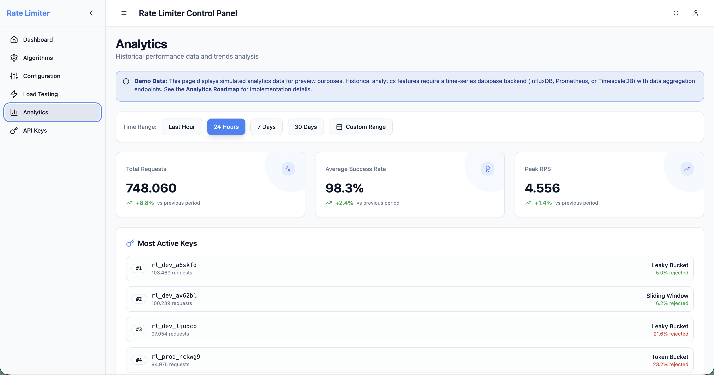

# Rate Limiter Dashboard

A comprehensive, real-time dashboard for monitoring and managing distributed rate limiting systems. Built with modern web technologies to provide deep insights into rate limiting performance, algorithm comparison, and traffic analytics.


## 🚀 Features

### 📊 Real-time Monitoring Dashboard
- **Live Metrics**: Real-time tracking of active keys, requests per second, success rates
- **Interactive Charts**: Time-series visualization with 5-second updates
- **Algorithm Performance**: Compare Token Bucket, Sliding Window, Fixed Window, and Leaky Bucket algorithms
- **Activity Feed**: Live stream of rate limiting decisions and events
- **Health Monitoring**: Backend connectivity and Redis health status

### 🔧 Algorithm Simulation & Testing
- **Algorithm Comparison**: Side-by-side testing of different rate limiting algorithms
- **Traffic Pattern Simulation**: Generate steady, bursty, spike, or custom traffic patterns
- **Real-time Visualization**: Live charts showing token levels and request handling
- **Performance Analytics**: Detailed statistics on rejection rates, response times, and efficiency
- **Interactive Configuration**: Adjust capacity, refill rates, and time windows on the fly

### 📈 Advanced Analytics
- **Historical Data Analysis**: Performance trends over configurable time ranges (1h, 24h, 7d, 30d)
- **Top Keys Analysis**: Identify most active keys and their usage patterns
- **Algorithm Performance Metrics**: Memory usage, efficiency scores, and throughput comparison
- **Usage Trends**: Visualize traffic patterns and identify peak usage periods
- **Smart Alerts**: Automated notifications for spikes, degradation, and anomalies
- **Data Export**: CSV and JSON export functionality for external analysis

### 🔑 API Key Management
- **Comprehensive Key Management**: Create, view, edit, and delete API keys
- **Advanced Access Control**: IP whitelisting/blacklisting support
- **Usage Statistics**: Track total requests, success rates, and rate limiting events
- **Bulk Operations**: Mass activate, deactivate, delete, or export keys
- **Access Logs**: Detailed request history with IP addresses and response times
- **Key Regeneration**: Secure key rotation functionality

### ⚙️ Configuration Management
- **Global Configuration**: System-wide defaults for capacity, refill rates, and cleanup intervals
- **Per-Key Configuration**: Individual rate limiting rules for specific keys
- **Pattern-Based Rules**: Wildcard pattern matching for flexible configuration
- **Hierarchical Configuration**: Override global settings with specific rules
- **Configuration Visualization**: Interactive hierarchy display
- **Import/Export**: Backup and restore configurations via JSON/CSV

### 🧪 Load Testing Suite
- **Traffic Pattern Generation**: Constant, ramp-up, spike, and step-load patterns
- **Configurable Parameters**: Request rate, duration, concurrency, and timeout settings
- **Real-time Monitoring**: Live metrics during test execution
- **Performance Analysis**: P50, P95, P99 response times and success rates
- **Historical Test Results**: Compare performance across different test runs
- **Test Configuration Management**: Save and reuse test configurations

### 🎨 User Experience
- **Modern UI**: Clean, responsive design with dark/light theme support
- **Keyboard Shortcuts**: Efficient navigation with hotkeys (Alt+D for Dashboard, Alt+A for Algorithms, etc.)
- **Mobile Responsive**: Optimized for desktop, tablet, and mobile devices
- **Accessibility**: WCAG compliant with proper ARIA labels and keyboard navigation
- **Real-time Updates**: Live data streaming with WebSocket-like polling
- **Error Handling**: Graceful error states with retry mechanisms

## 🛠 Technology Stack

### Frontend
- **React 18** - Modern React with hooks and concurrent features
- **TypeScript** - Type-safe development with excellent IDE support
- **Vite** - Fast build tool with hot module replacement
- **React Router** - Client-side routing with nested routes
- **Tailwind CSS** - Utility-first CSS framework with custom design system
- **shadcn/ui** - High-quality, accessible UI component library
- **Recharts** - Composable charting library for React
- **React Query** - Server state management with caching
- **Sonner** - Beautiful toast notifications
- **Lucide React** - Consistent icon library

### Development Tools
- **ESLint** - Code linting with modern rules
- **TypeScript** - Static type checking
- **PostCSS** - CSS processing with autoprefixer
- **Lovable** - AI-powered development platform integration

### Backend Integration
- **REST API** - HTTP-based API communication
- **Real-time Polling** - Live data updates every 5 seconds
- **Error Handling** - Robust error handling with user feedback
- **Authentication** - Basic auth for admin endpoints
- **CORS Support** - Cross-origin resource sharing configuration

## 🔌 Backend Integration Architecture

### Real Backend APIs (✅ Production Ready)

The dashboard connects to a distributed rate limiter backend running on **http://localhost:8080** with the following features:

#### **Dashboard Page** (`/`)
- **Status**: ✅ **Fully Connected to Real Backend**
- **Data Source**: `/metrics` endpoint (polled every 5 seconds via AppContext)
- **Real-time Metrics**:
  - `activeKeys` - Count of keys from `realtimeMetrics.keyMetrics`
  - `requestsPerSecond` - Calculated from metric deltas between polls
  - `successRate` - Computed from `totalAllowedRequests / totalRequests`
  - `timeSeriesData` - Built from actual polling updates (last 10 data points)
- **Algorithm Distribution**: Fetched from `/admin/keys` endpoint every 30 seconds
- **Activity Feed**: Generated from real key access patterns (`lastAccessTime`)
- **Health Check**: `/actuator/health` for backend/Redis status
- **Adaptive Status Card**: Shows ML-driven adaptive rate limiting status

#### **Adaptive Rate Limiting Page** (`/adaptive`) 🆕
- **Status**: ✅ **Fully Connected to Real Backend**
- **Endpoints**:
  - `GET /api/ratelimit/adaptive/{key}/status` - Get adaptive status with reasoning
  - `GET /api/ratelimit/adaptive/config` - Get adaptive configuration
  - `POST /api/ratelimit/adaptive/{key}/override` - Set manual override
  - `DELETE /api/ratelimit/adaptive/{key}/override` - Remove override
- **Features**:
  - Real-time adaptive configuration display
  - Key status table with mode (STATIC/ADAPTIVE/LEARNING/OVERRIDE)
  - Confidence meters and progress bars
  - Reasoning explanations from ML model
  - Manual override controls for emergency intervention
  - Auto-refresh every 30 seconds
- **New in v1.2**: Integrated with backend adaptive rate limiting engine

#### **Configuration Page** (`/configuration`)
- **Status**: ✅ **Fully Connected to Real Backend**
- **Endpoints**:
  - `GET /api/ratelimit/config` - Fetch current configuration
  - `POST /api/ratelimit/config/keys/{key}` - Update key-specific config
  - `POST /api/ratelimit/config/patterns/{pattern}` - Update pattern config
  - `DELETE /api/ratelimit/config/keys/{key}` - Remove key config
- **Features**: CRUD operations for global, per-key, and pattern-based configurations

#### **API Keys Page** (`/api-keys`)
- **Status**: ✅ **Fully Connected to Real Backend**
- **Endpoints**:
  - `GET /admin/keys` (requires Basic Auth: admin/admin123)
- **Real Data**:
  - Active keys with capacity, algorithm, last access time
  - Key statistics (total/active counts)
- **Mock Data**:
  - ⚠️ Access logs (backend endpoint not yet implemented)

#### **Load Testing Page** (`/load-testing`)
- **Status**: ✅ **Fully Connected to Real Backend**
- **Endpoint**: `POST /api/benchmark/run`
- **Backend Execution**:
  - Real concurrent load testing via `BenchmarkController`
  - Actual rate limiter checks against Redis/in-memory backend
  - Production-grade performance metrics (throughput, success rate, duration)
- **Parameters**:
  - `concurrentThreads`, `requestsPerThread`, `durationSeconds`
  - `tokensPerRequest`, `delayBetweenRequestsMs`, `keyPrefix`
- **Returns**: Real performance data from distributed rate limiter

### Demo/Educational Features (⚠️ Mock Data)

#### **Analytics Page** (`/analytics`)
- **Status**: ⚠️ **Demo Data Only**
- **Reason**: Requires time-series database backend (InfluxDB, Prometheus, TimescaleDB)
- **Missing Backend**: 
  - Historical data storage and aggregation
  - `/api/analytics/*` endpoints for trends, top keys, performance metrics
- **Current Implementation**: Client-side simulated data for preview purposes
- **Future**: See [Analytics Feature Roadmap](#analytics-feature-roadmap)

#### **Algorithms Page** (`/algorithms`)
- **Status**: 🎓 **Educational Client-Side Simulation**
- **Purpose**: Interactive algorithm comparison and visualization
- **Implementation**: `AlgorithmSimulator` class with accurate algorithm logic
- **Use Case**: Learning tool for understanding rate limiting behavior
- **Note**: Intentionally client-side (not a backend integration gap)

### Proxy Configuration

The frontend uses Vite's development proxy to route API calls:

```typescript
// vite.config.ts
export default defineConfig({
  server: {
    proxy: {
      '/api': 'http://localhost:8080',
      '/actuator': 'http://localhost:8080',
      '/admin': 'http://localhost:8080',
      '/metrics': 'http://localhost:8080',
    }
  }
})
```

**Benefits**:
- Same-origin requests (no CORS in development)
- Seamless backend switching via env variables
- Hot-reload with backend updates

### Data Flow Architecture

```
┌─────────────────┐         ┌──────────────────┐         ┌─────────────────┐
│   Dashboard     │         │   Vite Proxy     │         │   Spring Boot   │
│   (React App)   │────────▶│   localhost:5173 │────────▶│   Backend       │
│   Port 5173     │  HTTP   │                  │  HTTP   │   Port 8080     │
└─────────────────┘         └──────────────────┘         └─────────────────┘
                                                                    │
                                                                    ▼
                                                           ┌─────────────────┐
                                                           │   Redis         │
                                                           │   Port 6379     │
                                                           └─────────────────┘

AppContext (React)
  └─► Poll /metrics every 5s
       └─► Update realtimeMetrics state
            └─► Dashboard consumes via useApp() hook

LoadTesting Page
  └─► POST /api/benchmark/run (one-time request)
       └─► Backend executes concurrent load test
            └─► Returns real performance metrics

Configuration Page
  └─► GET/POST/DELETE /api/ratelimit/config/*
       └─► Backend updates ConfigurationResolver
            └─► Returns current config state
```

### Analytics Feature Roadmap

To implement real analytics features, the backend needs:

1. **Time-Series Database Integration**
   - InfluxDB, Prometheus, or TimescaleDB
   - Store historical metrics with timestamps
   - Efficient aggregation queries

2. **Backend Endpoints**
   ```
   GET /api/analytics/performance?timeRange=24h
   GET /api/analytics/top-keys?limit=10&sortBy=requests
   GET /api/analytics/algorithm-performance
   GET /api/analytics/usage-trends?interval=1h
   GET /api/analytics/alerts?severity=high
   ```

3. **Data Collection**
   - Metrics streaming to time-series DB
   - Scheduled aggregation jobs
   - Alert threshold monitoring

4. **Export Functionality**
   - CSV/JSON generation on backend
   - Date range filtering
   - Compressed archive downloads

See [GitHub Issue #XXX](https://github.com/uppnrise/distributed-rate-limiter/issues) for implementation tracking.

## 🚀 Quick Start

### Prerequisites
- **Node.js 18+** and npm
- **Java 21** for backend (required for real data)
- **Docker** (optional, for Redis)
- A distributed rate limiter backend running on `localhost:8080`

### Development Workflow

#### 1. Start the Backend (Required)

```bash
# From project root
cd /Users/upp/Development/workspaces/open-source/distributed-rate-limiter

# Start Redis (optional - backend has in-memory fallback)
docker-compose up -d redis

# Start Spring Boot backend
./mvnw spring-boot:run

# Backend will start on http://localhost:8080
# Wait for "Started DistributedRateLimiterApplication" message
```

#### 2. Start the Frontend

```bash
# Navigate to dashboard directory
cd examples/web-dashboard

# Install dependencies (first time only)
npm install

# Start development server
npm run dev

# Frontend will start on http://localhost:5173
# Vite proxy automatically routes /api, /actuator, /admin, /metrics to backend
```

#### 3. Verify Connection

1. Open http://localhost:5173 in your browser
2. Check the **Health Status** banner at the top of the Dashboard
   - ✅ Green: "Connected to backend API" (Redis: UP)
   - ❌ Red: "Backend API unavailable"
3. Observe real metrics updating every 5 seconds

### Quick Test

Generate some traffic to see live data:

```bash
# In a new terminal, make some rate limit requests
curl -X POST http://localhost:8080/api/ratelimit/check \
  -H "Content-Type: application/json" \
  -d '{"key":"test-user-1","tokensRequested":1}'

# Repeat several times and watch Dashboard update
# You should see:
# - Active Keys increase
# - Requests/Second change
# - Time series chart update
# - Activity feed show new events
```

### Installation

```bash
# Clone the repository
git clone <repository-url>
cd distributed-rate-limiter/examples/web-dashboard

# Install dependencies
npm install

# Start development server (backend must be running first!)
npm run dev
```

The application will be available at `http://localhost:5173`

### Backend Requirements

The dashboard expects a rate limiter backend with the following endpoints:

#### Rate Limiting API
- `POST /api/ratelimit/check` - Check rate limit for a key
- `GET /api/ratelimit/config` - Get current configuration
- `POST /api/ratelimit/config/keys/{key}` - Update key-specific config
- `POST /api/ratelimit/config/patterns/{pattern}` - Update pattern config
- `DELETE /api/ratelimit/config/keys/{key}` - Remove key config

#### Adaptive Rate Limiting API 🆕
- `GET /api/ratelimit/adaptive/{key}/status` - Get adaptive status with ML reasoning
- `GET /api/ratelimit/adaptive/config` - Get adaptive configuration
- `POST /api/ratelimit/adaptive/{key}/override` - Set manual override
- `DELETE /api/ratelimit/adaptive/{key}/override` - Remove manual override

#### Admin API (Basic Auth: admin/admin123)
- `GET /admin/keys` - Get active keys and statistics

#### Benchmarking API
- `POST /api/benchmark/run` - Execute load test with real backend

#### Monitoring API
- `GET /metrics` - System metrics and performance data (polled every 5s)
- `GET /actuator/health` - Health check endpoint

See backend documentation for complete API reference.

## 📁 Project Structure

```
src/
├── components/           # Reusable React components
│   ├── ui/              # shadcn/ui base components
│   ├── layout/          # Layout components (Sidebar, TopNav)
│   ├── dashboard/       # Dashboard-specific components
│   ├── algorithms/      # Algorithm simulation components
│   ├── analytics/       # Analytics and reporting components
│   ├── apikeys/         # API key management components
│   ├── configuration/   # Configuration management components
│   └── loadtest/        # Load testing components
├── contexts/            # React context providers
├── hooks/               # Custom React hooks
├── lib/                 # Utility functions and configurations
├── pages/               # Page-level components
├── services/            # API service layers
├── types/               # TypeScript type definitions
├── utils/               # Helper functions and simulators
└── App.tsx             # Main application component
```

## 🎯 Key Components

### Dashboard (`/`)
Real-time monitoring with live metrics, charts, and activity feeds. Now includes an **Adaptive Status Card** showing ML-driven rate limiting insights.

### Adaptive Rate Limiting (`/adaptive`) 🆕
ML-driven adaptive rate limiting dashboard with:
- Configuration overview (enabled status, evaluation interval, thresholds)
- Key status table with mode, confidence, and reasoning
- Manual override controls for emergency intervention
- Real-time updates every 30 seconds

### Algorithms (`/algorithms`)
Interactive algorithm comparison with traffic simulation and performance analysis.

### Analytics (`/analytics`)
Historical performance analysis with trends, top keys, and alerts.

### Configuration (`/configuration`)
Comprehensive configuration management with global, key-specific, and pattern-based rules.

### API Keys (`/api-keys`)
Complete API key lifecycle management with usage tracking and access control.

### Load Testing (`/load-testing`)
Performance testing suite with configurable traffic patterns and detailed metrics.

## 🔧 Configuration

### Environment Variables
```bash
# Backend API base URL (default: http://localhost:8080)
VITE_API_BASE_URL=http://localhost:8080

# Enable development features
VITE_DEV_MODE=true
```

### Vite Configuration
The project uses Vite with:
- React SWC plugin for fast compilation
- Path aliases (@/* for src/*)
- Development server on port 8081
- Component tagging for development

### Theme Customization
The design system is built on Tailwind CSS with custom tokens:
- CSS custom properties for colors and spacing
- Light/dark theme support
- Responsive breakpoints
- Custom animations and transitions

## 📊 Performance Features

### Real-time Updates
- 5-second polling interval for live metrics
- Efficient data caching with React Query
- Optimized re-renders with React.memo and useMemo
- Background updates without UI blocking

### Algorithm Simulation
- Accurate implementations of all major rate limiting algorithms
- Configurable traffic patterns (steady, bursty, spike, custom)
- Real-time visualization with 60-point sliding window
- Performance metrics calculation (rejection rate, response time, efficiency)

### Load Testing
- Client-side traffic simulation
- Configurable request patterns and concurrency
- Real-time metrics collection and visualization
- Historical test result comparison

## 🛡 Security Features

- **Input Validation**: Client-side validation with server-side verification
- **XSS Protection**: Sanitized user inputs and safe HTML rendering
- **CORS Handling**: Proper cross-origin request configuration
- **Authentication**: Basic auth for admin endpoints
- **Rate Limiting**: Built-in protection against API abuse

## 🚀 Deployment

### Development
```bash
npm run dev
```

### Production Build
```bash
npm run build
npm run preview
```

### Docker (Optional)
```dockerfile
FROM node:18-alpine
WORKDIR /app
COPY package*.json ./
RUN npm ci --only=production
COPY . .
RUN npm run build
EXPOSE 8080
CMD ["npm", "run", "preview"]
```

## 📖 API Integration

The dashboard integrates with a distributed rate limiter backend. See [API_INTEGRATION.md](./API_INTEGRATION.md) for:
- Complete API endpoint documentation
- Request/response schemas
- Authentication requirements
- Error handling guidelines
- Backend setup instructions

## 📸 Dashboard Screenshots

### 📊 Live Monitoring Dashboard

Real-time metrics with live charts, algorithm distribution, and activity feed.

### 🧪 Load Testing Interface

Execute production-grade load tests with real-time progress and comprehensive results.

### ⚙️ Configuration Management

Manage global, per-key, and pattern-based rate limiting configurations.

### 🔑 API Keys Management

Track active keys with statistics, admin controls, and bulk operations.

### 📈 Analytics & Trends

Historical performance analysis with time-series data *(demo preview - requires time-series database backend)*.

### 🧮 Algorithm Comparison

Interactive educational tool for understanding and comparing rate limiting algorithms.

## 🤝 Contributing

1. Fork the repository
2. Create a feature branch (`git checkout -b feature/amazing-feature`)
3. Commit changes with conventional commits (`git commit -m 'feat: add amazing feature'`)
4. Push to branch (`git push origin feature/amazing-feature`)
5. Open a Pull Request

### Commit Convention
- `feat:` - New features
- `fix:` - Bug fixes
- `docs:` - Documentation updates
- `style:` - Code formatting
- `refactor:` - Code restructuring
- `test:` - Test additions/updates
- `chore:` - Maintenance tasks

## 📄 License

This project is licensed under the MIT License - see the [LICENSE](LICENSE) file for details.

## 🙏 Acknowledgments

- [shadcn/ui](https://ui.shadcn.com/) for the excellent component library
- [Recharts](https://recharts.org/) for beautiful, composable charts
- [Tailwind CSS](https://tailwindcss.com/) for the utility-first CSS framework
- [Lucide](https://lucide.dev/) for the comprehensive icon library
